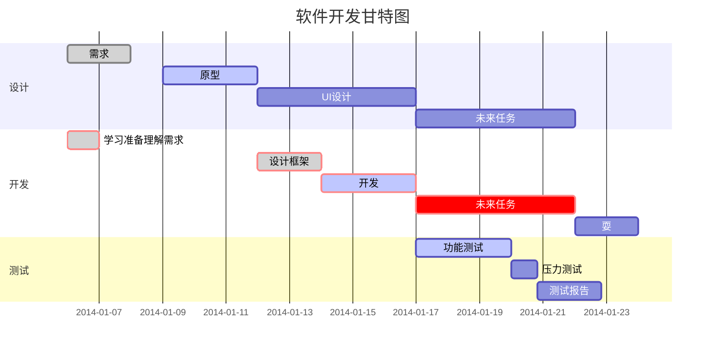

> # MyBlog
官网地址: [KissShot的康熙小窝](http://KissShot.top)
<u>__MyBlog - Just Fun And Test__</u>  
_我的吐槽:_<del>我也想好好做一个项目啊</del>

>> ## MySql初始
src/main/java/top/kissshot/myblog/sql.txt

>> ## 补充说明
src/main/java/top/kissshot/myblog/tip.txt
创建脚注格式类似这样 [^RUNOOB]。
[^RUNOOB]: 菜鸟教程 -- 学的不仅是技术，更是梦想！！！

>>> ## MarkDown测试
* 第一项
    - 第一项嵌套的第一个元素
    - 第一项嵌套的第二个元素
* 第二项
    - 第一项嵌套的第一个元素
    - 第一项嵌套的第二个元素

>>> 1. 第一项：
    - 第一项嵌套的第一个元素
    - 第一项嵌套的第二个元素
2. 第二项：
    - 第二项嵌套的第一个元素
    - 第二项嵌套的第二个元素
    
```javascript
$(document).ready(function () {
    alert('RUNOOB');
});
```
使用 <kbd>Ctrl</kbd>+<kbd>Alt</kbd>+<kbd>Del</kbd> 重启电脑




$$
\mathbf{V}_1 \times \mathbf{V}_2 =  \begin{vmatrix} 
\mathbf{i} & \mathbf{j} & \mathbf{k} \\
\frac{\partial X}{\partial u} &  \frac{\partial Y}{\partial u} & 0 \\
\frac{\partial X}{\partial v} &  \frac{\partial Y}{\partial v} & 0 \\
\end{vmatrix}
$$tep1}{\style{visibility:hidden}{(x+1)(x+1)}}
$$


| 左对齐 | 右对齐 | 居中对齐 |
| :---| ---: | :---: |
| 单元格 | 单元格 | 单元格 |
| 单元格 | 单元格 | 单元格 |

链接也可以用变量来代替，文档末尾附带变量地址：  
这个链接用 1 作为网址变量 [Google][1]  
这个链接用 runoob 作为网址变量 [Runoob][runoob]  
然后在文档的结尾为变量赋值（网址）

[1]: http://www.google.com/
[runoob]: http://www.runoob.com/